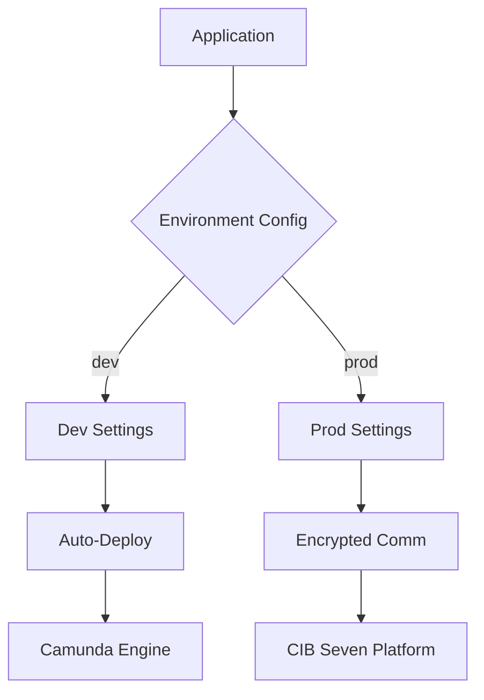

# CIB seven - Getting Started with CIB seven and Spring Boot

This Repository contains the example Spring Boot application for the guide at [docs.cibseven.org](https://docs.cibseven.org/get-started/spring-boot/).

This project requires Java 17.

Every step of the tutorial was tagged in this repository. You can jump to the final state of each step
by the following command:

```
git checkout -f Step-X
```

If you want to follow the tutorial along please clone this repository and checkout the `Start` tag.

```
git clone https://github.com/cibseven/cibseven-get-started-spring-boot.git
git checkout -f Start
```

License: The source files in this repository are made available under the [Apache License Version 2.0](./LICENSE).


(ai)
User Guide - Configuration
 Yang Wenhua
Areas of Contribution:
Analysis of Core Configuration Items
Camunda Integration Configuration
CIB Seven Service Connection
Multi-environment Management

```markdown
# CIBSeven Integration Configuration Center

[](https://opensource.org/licenses/MIT)
[](https://spring.io/projects/spring-boot)

##  Key Features

-  **Out-of-the-box** Pre-configured Camunda workflow engine and CIB Seven connectivity
-  **Secure Communication** AES256 encryption with sensitive data protection
-  **Multi-environment Management** One-click switching between dev/test/prod
-  **Monitoring Ready** Integrated Spring Actuator health checks
-  **Auto Deployment** BPMN process auto-loading mechanism

##  Quick Start

### Prerequisites
- JDK 17+
- Camunda 7.18+
- MySQL 8.0+/PostgreSQL 14+

### Setup Steps
1. Clone repository
```bash
git clone https://github.com/yourorg/cibseven-config.git
```

2. Set environment variables
```bash
export CIB_API_KEY=your_dev_key
export MAIL_PASSWORD=your_smtp_pass
```

3. Start development environment
```bash
mvn spring-boot:run -Dspring.profiles.active=dev
```

##  System Architecture



##  Configuration Guide

### Basic Configuration
```yaml
# application.yaml
server:
  port: 8080
spring:
  application:
    name: cibseven-integration
  profiles:
    active: dev  # Default environment

cibseven:
  platform:
    base-url: https://api.cibseven.com/v1
    api-key: ${CIB_API_KEY:default_dev_key}  # Use encryption in production
```

### Camunda Configuration
```yaml
camunda.bpm:
  admin-user:  # Dev environment only
    id: demo
    password: demo
  database:
    schema-update: true  # Auto DB schema sync
  auto-deployment-enabled: true  # BPMN auto-deploy
```

##  Advanced Configuration

### Thread Pool Optimization
```yaml
spring:
  task:
    execution:
      pool:
        core-size: 10
        max-size: 50
        queue-capacity: 1000
```

### Email Integration
```yaml
spring:
  mail:
    host: smtp.cibseven.com
    username: ${MAIL_USER}
    password: ${MAIL_PASSWORD}  # Use Jasypt encryption
```

##  Troubleshooting

### Processes Not Auto-Deployed
**Symptom**: BPMN files not loading  
 **Solution**:
1. Verify file location: `resources/processes/`
2. Confirm `.bpmn` extension
3. Validate config:
```yaml
camunda.bpm:
  auto-deployment-enabled: true
```

### Admin Login Failure
**Symptom**: Can't access Camunda Console  
 **Solution**:
```yaml
# Production config
camunda.bpm:
  admin-user.id: ""  # Disable default account
  security:
    filter-url: /engine-rest/*,/camunda/*
```

##  Extended Configuration

### Sensitive Data Encryption
```yaml
cibseven:
  platform:
    api-key: ENC(AbCdEfG123456)  # Jasypt encrypted value

# Add encryption password at startup
java -jar app.jar --jasypt.encryptor.password=${ENCRYPT_KEY}
```

### Multi-Environment Setup
```bash
# Production startup
java -jar app.jar --spring.profiles.active=prod \
                  --jasypt.encryptor.password=${PROD_KEY}
```

---

