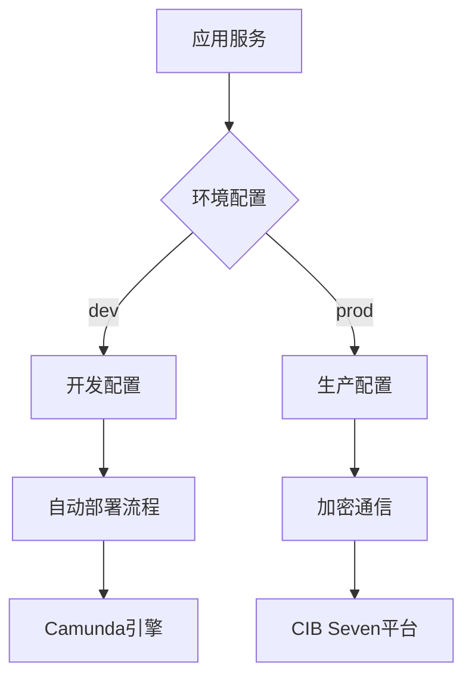

 <!-- by 韩辉 -->
 # CIB Seven 平台与 Spring Boot 集成项目简介
## 项目背景
随着企业数字化转型的加速，对高效、灵活且可扩展的技术架构需求日益增长。CIB Seven 平台作为企业内部的重要业务支撑系统，需要与现代开发框架和技术进行深度集成，以提升开发效率、系统性能和可维护性。Spring Boot 作为当前流行的 Java 开发框架，以其简洁的配置、丰富的生态和强大的性能，成为企业应用开发的首选。

## 项目目标
本项目旨在将 CIB Seven 平台与 Spring Boot 框架进行深度集成，实现以下目标：

提升开发效率：利用 Spring Boot 的自动配置和快速开发特性，减少开发人员的配置和编码工作，加速项目交付。
增强系统性能：通过 Spring Boot 的性能优化和异步处理机制，提升系统的响应速度和吞吐量。
提高可维护性：借助 Spring Boot 的模块化设计和丰富的生态工具，简化系统维护和升级过程。
促进技术创新：引入 Spring Boot 的新技术和新特性，推动 CIB Seven 平台的技术创新和业务创新。
## 集成内容
本项目主要涵盖以下几个方面的集成：

基础框架集成：将 Spring Boot 作为 CIB Seven 平台的基础开发框架，替代原有的开发框架，实现快速开发和高效运维。
数据访问集成：利用 Spring Data JPA 或 MyBatis 等持久层框架，简化数据访问层的开发，提高数据访问效率。
安全框架集成：集成 Spring Security 或 Shiro 等安全框架，增强系统的安全性，保护企业数据和用户信息。
消息队列集成：引入 RabbitMQ、Kafka 等消息队列中间件，实现系统间的异步通信和解耦，提高系统的可扩展性和可靠性。
缓存集成：集成 Redis、Ehcache 等缓存中间件，提升系统的性能和响应速度，减少数据库访问压力。
日志管理集成：利用 Spring Boot 的日志管理框架，如 Logback 或 Log4j2，实现日志的统一管理和分析。
## 预期成果
通过本项目的实施，预期将取得以下成果：

开发效率显著提升：开发人员能够更快速地完成业务功能的开发和测试，缩短项目交付周期。
系统性能明显增强：系统的响应速度和吞吐量得到显著提升，满足企业高并发、高负载的业务需求。
可维护性大幅提高：系统的模块化和可配置性得到增强，降低维护成本，提高系统的可扩展性和可复用性。
技术创新持续推动：引入新技术和新特性，推动 CIB Seven 平台的技术创新和业务创新，提升企业的竞争力。
## 总结
CIB Seven 平台与 Spring Boot 的集成项目是企业数字化转型的重要一步。通过深度集成，将充分发挥 Spring Boot 的技术优势，提升 CIB Seven 平台的开发效率、系统性能和可维护性，为企业的持续发展提供强有力的技术支撑。

# 测试 CIB seven 集成 <!-- by 刘仁炽 -->
## 测试目的
验证 CIB seven 集成是否正常工作，包括流程定义的部署以及流程实例的启动等关键功能，确保系统在集成 CIB seven 后能够按照预期运行，各组件之间的交互正常。
## 测试环境
- 操作系统：[Windows 10  ]
- 开发工具：[IntelliJ IDEA 2022.3.2]
- 运行环境：[JDK 11、Spring Boot 2.6.7、Camunda BPM 7.15.0]
- 数据库：[H2 数据库 2.1.210]
- 验证 CIB seven 集成是否正常工作，包括流程定义的部署以及流程实例的启动等关键功能，确保系统在集成 CIB seven 后能够按照预期运行，各组件之间的交互正常。
## 测试步骤
1. 创建测试类：在 src/main/java/org/cibseven/getstarted/loanapproval/ 路径下创建 LoanApprovalIntegrationTest.java 文件，用于编写具体的集成测试代码。
2. 编写测试代码：
```bash
package org.cibseven.getstarted.loanapproval;

import org.camunda.bpm.engine.RuntimeService;
import org.camunda.bpm.engine.runtime.ProcessInstance;
import org.junit.jupiter.api.Test;
import org.springframework.beans.factory.annotation.Autowired;
import org.springframework.boot.test.context.SpringBootTest;
import org.springframework.test.context.ActiveProfiles;

import java.util.List;

import static org.assertj.core.api.Assertions.assertThat;

@SpringBootTest(webEnvironment = SpringBootTest.WebEnvironment.RANDOM_PORT)
@ActiveProfiles("test")
public class PostDeployIntegrationTest {

    @Autowired
    private RuntimeService runtimeService;

    @Test
    public void shouldStartProcessAfterDeployment() throws Exception {
        // 等待应用完全启动并触发 PostDeployEvent
        Thread.sleep(5000); // 简单等待，实际测试中可使用更优雅的等待机制
        
        // 验证是否已启动流程实例
        List<ProcessInstance> instances = runtimeService
                .createProcessInstanceQuery()
                .processDefinitionKey("loanApproval")
                .list();
        
        assertThat(instances).isNotEmpty();
        assertThat(instances.size()).isEqualTo(1);
    }
}
```
3. 在pom.xml添加依赖
```bash
<dependency>
    <groupId>org.assertj</groupId>
    <artifactId>assertj-core</artifactId>
    <scope>test</scope>
</dependency>
<dependency>
    <groupId>org.junit.jupiter</groupId>
    <artifactId>junit-jupiter-engine</artifactId>
    <scope>test</scope>
</dependency>
```

4. 配置测试环境：在 src/test/resources 目录下的 application.yaml 文件中添加以下配置信息：
```bash
spring.datasource.url=jdbc:h2:mem:test;DB_CLOSE_DELAY=-1
spring.datasource.driver-class-name=org.h2.Driver
spring.datasource.username=sa
spring.datasource.password=
camunda.bpm.auto-deployment-enabled=false
logging.level.org.camunda.bpm=DEBUG
```
5. 执行测试：使用 IDE 的测试运行器运行 LoanApprovalIntegrationTest 类中的测试方法；或者使用项目构建工具（如 Maven 的 mvn test 命令来执行测试。

## 预期结果
- shouldDeployProcessDefinition 测试方法中，能够获取到键为 "loanApproval" 的流程定义，断言验证流程定义不为空，测试通过。
- shouldStartProcessInstance 测试方法中，能够成功启动键为 "loanApproval" 的流程实例，断言验证流程实例不为空且流程定义 ID 不为空，测试通过。

使用教程 - 配置
<!-- by 杨文华 -->
贡献范围：核心配置项解析、Camunda集成配置、CIB Seven服务连接、多环境管理

```markdown
# CIBSeven 集成配置中心

[](https://opensource.org/licenses/MIT)
[](https://spring.io/projects/spring-boot)

##  系统特性

-  **开箱即用**：预配置Camunda流程引擎与CIB Seven服务连接
-  **安全通信**：支持AES256加密与敏感信息加密存储
-  **多环境管理**：dev/test/prod环境配置一键切换
-  **监控就绪**：集成Spring Actuator健康检查与指标监控
-  **自动部署**：BPMN流程定义文件自动加载机制

##  快速开始

### 环境要求
- JDK 17+
- Camunda 7.18+
- MySQL 8.0+ / PostgreSQL 14+

### 启动步骤
1. 克隆配置仓库
```bash
git clone https://github.com/yourorg/cibseven-config.git
```

2. 配置环境变量
```bash
export CIB_API_KEY=your_development_key
export MAIL_PASSWORD=your_smtp_password
```

3. 启动开发环境
```bash
mvn spring-boot:run -Dspring.profiles.active=dev
```

##  系统架构



##  配置指南

### 基础配置
```yaml
# application.yaml
server:
  port: 8080
spring:
  application:
    name: cibseven-integration
  profiles:
    active: dev  # 默认开发环境

cibseven:
  platform:
    base-url: https://api.cibseven.com/v1
    api-key: ${CIB_API_KEY:default_dev_key}  # 生产环境必须使用加密存储
```

### Camunda引擎配置
```yaml
camunda.bpm:
  admin-user:  # 仅限开发环境使用
    id: demo
    password: demo
  database:
    schema-update: true  # 自动同步表结构
  auto-deployment-enabled: true  # 自动部署BPMN流程
```

##  高级配置

### 线程池优化
```yaml
spring:
  task:
    execution:
      pool:
        core-size: 10
        max-size: 50
        queue-capacity: 1000
```

### 邮件服务集成
```yaml
spring:
  mail:
    host: smtp.cibseven.com
    username: ${MAIL_USER}
    password: ${MAIL_PASSWORD}  # 建议使用Jasypt加密
```

##  常见问题

### 流程未自动部署
**现象**：启动后未加载BPMN文件  
 **解决方案**：
1. 确认文件位于 `resources/processes/` 目录
2. 检查文件扩展名为 `.bpmn`
3. 验证配置：
```yaml
camunda.bpm:
  auto-deployment-enabled: true  # 必须为true
```

### 管理员登录失败
**现象**：无法访问Camunda控制台  
 **解决方案**：
```yaml
# 生产环境配置
camunda.bpm:
  admin-user.id: ""  # 禁用内置账户
  security:
    filter-url: /engine-rest/*,/camunda/*
```

##  扩展阅读

### 配置加密方案
```yaml
cibseven:
  platform:
    api-key: ENC(AbCdEfG123456)  # Jasypt加密值

# 启动命令添加加密密钥
java -jar app.jar --jasypt.encryptor.password=${ENCRYPT_KEY}
```

### 多环境配置示例
```bash
# 生产环境启动命令
java -jar app.jar --spring.profiles.active=prod \
                  --jasypt.encryptor.password=${PROD_KEY}
```

---


CIB Seven Spring Boot 项目安装部署指南
<!--覃雄伟-->
1. 环境准备
1.1 系统要求
操作系统: Windows 10+/Linux/macOS

Java: JDK 17 或更高版本

构建工具: Maven 3.6+ 或 Gradle 7.x

数据库: MySQL 5.7+/PostgreSQL 12+ (根据项目配置)

可选工具: Camunda Modeler (用于编辑BPMN文件)

1.2 安装必要软件
Java 安装

# Linux (Ubuntu/Debian)
sudo apt update
sudo apt install openjdk-17-jdk

# Windows
# 从 https://adoptium.net/ 下载并安装JDK 17

# 验证安装
java -version
Maven 安装

# Linux (Ubuntu/Debian)
sudo apt install maven

# Windows
# 从 https://maven.apache.org/download.cgi 下载并安装

# 验证安装
mvn -v

<!--张佳-->
2. 获取项目代码
2.1 克隆仓库

git clone https://github.com/your-repository/cibseven-springboot-project.git
cd cibseven-springboot-project
2.2 检查分支

git branch -a
git checkout main  # 或适当的分支
3. 数据库配置
3.1 创建数据库
查看 application.yaml 配置


spring:
  datasource:
    url: jdbc:mysql://localhost:3306/seven_spring_db?useSSL=false&characterEncoding=utf8
    username: springuser
    password: springpass
    driver-class-name: com.mysql.cj.jdbc.Driver
创建数据库


-- 通过 MySQL 客户端执行
CREATE DATABASE IF NOT EXISTS seven_spring_db 
DEFAULT CHARACTER SET utf8mb4 
DEFAULT COLLATE utf8mb4_unicode_ci;
创建数据库用户并授权


CREATE USER 'springuser'@'%' IDENTIFIED BY 'springpass';
GRANT ALL PRIVILEGES ON seven_spring_db.* TO 'springuser'@'%';
FLUSH PRIVILEGES;
PostgreSQL 版本示例：


CREATE DATABASE seven_spring_db 
ENCODING 'UTF8' 
LC_COLLATE 'en_US.UTF-8' 
LC_CTYPE 'en_US.UTF-8';

CREATE USER springuser WITH PASSWORD 'springpass';
GRANT ALL PRIVILEGES ON DATABASE seven_spring_db TO springuser;
4. 项目配置
4.1 配置文件修改
编辑 src/main/resources/application.yaml:


# 数据库配置
spring:
  datasource:
    url: jdbc:mysql://localhost:3306/cibseven_db
    username: your_username
    password: your_password

# CIB Seven 平台配置
cibseven:
  api:
    base-url: https://api.cibseven.org/v1
    api-key: your_api_key_here
    timeout: 5000

# Camunda 配置
camunda:
  bpm:
    database:
      schema-update: true
    admin-user:
      id: admin
      password: admin
4.2 环境变量配置 (可选)
可以设置以下环境变量替代配置文件中的敏感信息:


export SPRING_DATASOURCE_PASSWORD=your_db_password
export CIBSVEN_API_KEY=your_api_key
5. 构建项目
5.1 使用 Maven 构建

mvn clean install -DskipTests
5.2 构建 Docker 镜像 (可选)
如果项目包含 Dockerfile:


docker build -t cibseven-app:1.0 .

<!--覃雄伟-->
6. 部署项目
6.1 本地运行

mvn spring-boot:run

# 或者运行打包后的JAR
java -jar target/cibseven-getstarted-1.0.0.jar
6.2 生产环境部署
使用 Systemd (Linux)
创建服务文件 /etc/systemd/system/cibseven.service:


[Unit]
Description=CIB Seven Spring Boot Application
After=syslog.target network.target

[Service]
User=appuser
WorkingDirectory=/opt/cibseven
ExecStart=/usr/bin/java -jar /opt/cibseven/cibseven-getstarted-1.0.0.jar
SuccessExitStatus=143
Restart=always

[Install]
WantedBy=multi-user.target
然后启用并启动服务:


sudo systemctl daemon-reload
sudo systemctl enable cibseven
sudo systemctl start cibseven
使用 Docker Compose
创建 docker-compose.yml:


version: '3.8'

services:
  cibseven-app:
    image: cibseven-app:1.0
    ports:
      - "8080:8080"
    environment:
      - SPRING_DATASOURCE_URL=jdbc:mysql://db:3306/cibseven_db
      - SPRING_DATASOURCE_USERNAME=root
      - SPRING_DATASOURCE_PASSWORD=dbpassword
    depends_on:
      - db

  db:
    image: mysql:5.7
    environment:
      - MYSQL_ROOT_PASSWORD=dbpassword
      - MYSQL_DATABASE=cibseven_db
    volumes:
      - db_data:/var/lib/mysql
    ports:
      - "3306:3306"

volumes:
  db_data:
启动服务:


docker-compose up -d
6.3部署 BPMN 模型
部署 BPMN（Business Process Model and Notation）模型通常涉及将设计好的业务流程模型（以 .bpmn 文件格式）加载到流程引擎中，使其能够执行和管理流程实例。以下是详细的部署步骤和注意事项：

1. 设计并验证 BPMN 模型
工具选择：使用 BPMN 设计工具（如 Camunda Modeler、Signavio、Eclipse BPMN2 Modeler）创建或编辑 BPMN 2.0 标准的流程图。

验证模型：确保模型语法正确（如任务、网关、事件等元素是否符合 BPMN 规范），并导出为 .bpmn 或 .bpmn20.xml 文件。

2. 选择流程引擎
选择一个支持 BPMN 2.0 的流程引擎来部署和执行模型。常见的开源引擎包括：

Camunda Platform：适合复杂业务流程，提供丰富的管理和监控工具。

Flowable：轻量级引擎，支持快速集成。

Activiti：由 Alfresco 维护的经典引擎。

jBPM：基于 Java 的流程引擎，与 Red Hat 工具链集成。

3. 部署到流程引擎
以 Camunda 为例
安装流程引擎：

下载 Camunda 社区版。

可嵌入到 Java 应用（如 Spring Boot），或独立部署到 Tomcat/JBoss 服务器。

部署 BPMN 模型：

通过 REST API：


curl -X POST \
  "http://localhost:8080/engine-rest/deployment/create" \
  -H "Content-Type: multipart/form-data" \
  -F "deployment-name=my-process" \
  -F "deployment-source=local" \
  -F "deploy-changed-only=true" \
  -F "my-process.bpmn=@/path/to/your/model.bpmn"
通过管理界面：
访问 http://localhost:8080/camunda/app/welcome/，登录后进入 Cockpit，上传 .bpmn 文件。

通过代码（Java/Spring Boot）：


@Autowired
private RepositoryService repositoryService;

public void deployProcess() {
  repositoryService.createDeployment()
    .addClasspathResource("processes/my-process.bpmn")
    .name("My Process Deployment")
    .deploy();

<!--张佳-->
}7. 验证部署
7.1 检查应用状态

curl http://localhost:8080/actuator/health
预期输出:


{"status":"UP"}
7.2 访问应用接口
Swagger UI (如果已配置): http://localhost:8080/swagger-ui.html

Camunda Tasklist: http://localhost:8080/camunda/app/tasklist

8. 常见问题解决
8.1 数据库连接问题
错误信息: Cannot create connection to database server

解决方案:

1. 基础检查
(1) 数据库服务是否运行？
本地数据库：检查数据库服务是否启动。


# MySQL
systemctl status mysql     # Linux
sudo /usr/local/mysql/support-files/mysql.server status  # macOS

# PostgreSQL
systemctl status postgresql
远程数据库：确认目标服务器IP和端口是否可访问。


telnet <数据库IP> 3306    # 测试MySQL端口连通性
nc -zv <数据库IP> 5432    # 测试PostgreSQL端口
(2) 连接参数是否正确？
检查 application.properties 中的配置：

URL格式：确保JDBC URL正确（注意数据库名、端口、SSL配置）。


# 正确示例（MySQL）
spring.datasource.url=jdbc:mysql://localhost:3306/cibseven_db?useSSL=false&serverTimezone=UTC
如果数据库名包含特殊字符（如 -），需用反引号包裹：`cib-seven-db`。

用户名/密码：确保无拼写错误，密码是否包含特殊字符（如 @ 需转义为 %40）。

8.2 CIB Seven API 认证失败
错误信息: 401 Unauthorized

解决方案:

1. 检查API凭证
核对密钥/令牌：确认 API Key、Client ID、Secret Key 是否与CIB Seven提供的完全一致（注意大小写、空格或特殊字符）。

权限和有效期：确认密钥未被禁用、未过期，且拥有目标API的访问权限。

认证方式：检查文档是否要求特定认证方式（如 OAuth 2.0、Bearer Token、Basic Auth）。

2. 验证请求头（Headers）
Authorization头格式：

确保使用正确的格式，例如：


Authorization: Bearer <your_token>
检查是否遗漏Bearer关键字或Token拼接错误。

其他必要头字段：

确认是否遗漏 Content-Type（如 application/json）、X-API-Key 等自定义头。

8.3 BPMN 部署失败
错误信息: Failed to deploy BPMN model

解决方案:

1. 检查BPMN模型合法性
语法错误：确保BPMN文件符合BPMN 2.0规范。

使用BPMN Validator或IDE插件（如Camunda Modeler、Eclipse BPMN2插件）检查模型。

常见错误：未闭合的网关、缺失的任务定义、无效的连线（Sequence Flow）等。

XML格式问题：检查BPMN文件是否为有效XML。

使用XML验证工具（如XML Lint）检查标签闭合和属性合法性。

重复的ID：确保所有元素的id唯一，避免重复。

特殊字符：检查id或name中是否包含非法字符（如空格、特殊符号）。

2. 检查部署配置
资源路径：确认部署时指定的BPMN文件路径正确（绝对路径或相对路径）。

权限问题：确保部署用户对目标目录和文件有读写权限。

数据库连接：

检查数据库是否可达（如MySQL、PostgreSQL等）。

验证数据库用户权限（如Camunda引擎需要create和alter表的权限）。

引擎配置：

对于Camunda，检查processes.xml或bpm-platform.xml中的自动部署配置。

确保引擎版本与BPMN模型兼容（例如，某些新语法需要高版本引擎支持）。

<!--覃雄伟-->
9. 升级指南
拉取最新代码:


git pull origin main
重新构建项目:


mvn clean install
重启服务:


sudo systemctl restart cibseven
# 或
docker-compose up -d --build

10. 备份与恢复
10.1 数据库备份

mysqldump -u username -p cibseven_db > cibseven_backup_$(date +%F).sql
10.2 恢复数据库

mysql -u username -p cibseven_db < cibseven_backup_2023-01-01.sql

  Spring Boot 快速启动项目模板，支持企业级应用开发的全流程工具链。  

---
<!--蓝李鹏-->
## 功能特性  

### 核心模块  
- **预配置 Maven 构建**  
  - 内置 Spring Boot 3.1.5、Spring Web 6.0.13、Spring Data JPA 3.1.5  
  - 集成 Lombok 1.18.28 简化 POJO 开发  
  - 自动生成 `.gitignore` 和 `HELP.md` 文件  
- **示例 REST API 接口**  
  - `/api/v1/hello` (GET): 返回 JSON 格式欢迎消息  
  - `/api/v1/users` (POST): 用户注册接口（示例请求体见下文）  
  - 全局异常处理：支持 `404`（资源未找到）、`500`（服务器错误）等状态码  
- **安全与监控**  
  - 集成 Spring Security 6.1.5 基础配置  
  - Actuator 端点开放 `/health` 和 `/info`  

### DevOps 集成  
- **CI/CD 流水线**  
  - GitHub Actions 配置：  
    - `build.yml`: 自动编译并运行单元测试  
    - `codeql-analysis.yml`: 代码安全扫描（每周定时触发）  
  - SonarQube 代码质量检测（需自行配置 `sonar-project.properties`）  
- **容器化支持**  
  - 多阶段构建 `Dockerfile`（优化镜像体积至 <150MB）  
  - `docker-compose.yml` 模板整合 PostgreSQL 和 Redis  

### 开发工具  
- 预置 Swagger UI 文档（访问路径：`/swagger-ui.html`）  
- H2 内存数据库配置（开发环境默认启用）  
- Flyway 数据库迁移脚本模板（位于 `src/main/resources/db/migration`）  

## 环境要求  

### 必需工具  
| 工具名称       | 最低版本   | 验证命令                  |  
|----------------|------------|---------------------------|  
| Java           | 17         | `java -version`           |  
| Maven          | 3.8.6      | `mvn -v`                  |  

### 可选工具  
| 工具名称       | 推荐版本   | 用途说明                  |  
|----------------|------------|---------------------------|  
| Docker         | 24.0.6     | 容器化部署                |  
| PostgreSQL     | 15.3       | 生产环境数据库            |  
| IntelliJ IDEA  | 2023.2     | IDE 集成支持              |  

## 安装与快速启动  

### 基础部署  
1. 克隆仓库并进入目录：  
   ```bash
   git clone https://github.com/cibseven/cibseven-get-started-springboot.git
   cd cibseven-get-started-springboot
编译项目：

bash
mvn clean install -DskipTests  # 跳过测试以加速构建
启动应用：

bash
mvn spring-boot:run -Dspring-boot.run.profiles=dev
验证运行状态
检查健康状态：

bash
curl http://localhost:8080/actuator/health
预期输出：{"status":"UP"}

测试示例接口：

bash
# GET 请求示例
curl http://localhost:8080/api/v1/hello

# POST 请求示例（用户注册）
curl -X POST -H "Content-Type: application/json" \
-d '{"name":"testUser", "email":"test@example.com"}' \
http://localhost:8080/api/v1/users
高级配置
环境变量覆盖
变量名	默认值	应用场景
SPRING_DATASOURCE_URL	jdbc:h2:mem:test	生产环境需替换为 PostgreSQL 连接字符串
LOGGING_LEVEL_ROOT	INFO	调试时可设置为 DEBUG
Docker 生产部署
构建镜像：

bash
docker build --build-arg JAR_FILE=target/*.jar -t springboot-prod .
运行容器（绑定外部数据库）：

bash
docker run -d -p 8080:8080 \
-e SPRING_DATASOURCE_URL=jdbc:postgresql://host.docker.internal:5432/mydb \
springboot-prod
多环境配置
application-dev.properties: 开发环境（默认激活）

application-prod.properties: 生产环境（需通过 -Dspring.profiles.active=prod 激活）

贡献指南
开发流程
分支命名规范：

功能开发：feat/描述性名称（如 feat/add-payment-module）

缺陷修复：fix/issue编号（如 fix/#123）

提交消息格式：


* 详细说明
* 关联的 Issue 编号（如 closes #456）
类型标签：feat、fix、docs、refactor、test

代码审查
必须通过至少 1 名核心成员的 Review

使用 GitHub 的 Files changed 标签进行行级评论

测试要求
新增功能需包含单元测试（JUnit 5 + Mockito）

集成测试需在 src/test/resources/application-test.properties 中配置
文档资源
核心参考
资源类型	链接
Spring Boot 注解大全	https://docs.spring.io/spring-boot/docs/current/reference/html/
Docker 最佳实践	https://docs.docker.com/develop/develop-images/dockerfile_best-practices/
社区资源
Stack Overflow 标签：spring-boot、docker

中文论坛：

Spring 中国社区：https://spring.io/community-china

开源中国 Spring Boot 专区
故障排除
常见问题
端口冲突：

修改 SERVER_PORT 或终止占用端口的进程：

bash
lsof -i :8080 && kill -9 <PID>
依赖下载失败：

配置 Maven 镜像源（编辑 ~/.m2/settings.xml）：

xml
<mirror>
  <id>aliyun-maven</id>
  <mirrorOf>*</mirrorOf>
  <name>阿里云仓库</name>
  <url>https://maven.aliyun.com/repository/public</url>
</mirror>
获取支持


