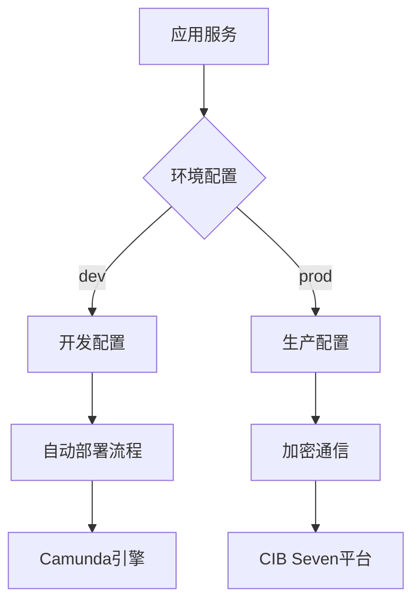

使用教程 - 配置
杨文华
贡献范围：核心配置项解析、Camunda集成配置、CIB Seven服务连接、多环境管理

```markdown
# CIBSeven 集成配置中心

[](https://opensource.org/licenses/MIT)
[](https://spring.io/projects/spring-boot)

##  系统特性

-  **开箱即用**：预配置Camunda流程引擎与CIB Seven服务连接
-  **安全通信**：支持AES256加密与敏感信息加密存储
-  **多环境管理**：dev/test/prod环境配置一键切换
-  **监控就绪**：集成Spring Actuator健康检查与指标监控
-  **自动部署**：BPMN流程定义文件自动加载机制

##  快速开始

### 环境要求
- JDK 17+
- Camunda 7.18+
- MySQL 8.0+ / PostgreSQL 14+

### 启动步骤
1. 克隆配置仓库
```bash
git clone https://github.com/yourorg/cibseven-config.git
```

2. 配置环境变量
```bash
export CIB_API_KEY=your_development_key
export MAIL_PASSWORD=your_smtp_password
```

3. 启动开发环境
```bash
mvn spring-boot:run -Dspring.profiles.active=dev
```

##  系统架构



##  配置指南

### 基础配置
```yaml
# application.yaml
server:
  port: 8080
spring:
  application:
    name: cibseven-integration
  profiles:
    active: dev  # 默认开发环境

cibseven:
  platform:
    base-url: https://api.cibseven.com/v1
    api-key: ${CIB_API_KEY:default_dev_key}  # 生产环境必须使用加密存储
```

### Camunda引擎配置
```yaml
camunda.bpm:
  admin-user:  # 仅限开发环境使用
    id: demo
    password: demo
  database:
    schema-update: true  # 自动同步表结构
  auto-deployment-enabled: true  # 自动部署BPMN流程
```

##  高级配置

### 线程池优化
```yaml
spring:
  task:
    execution:
      pool:
        core-size: 10
        max-size: 50
        queue-capacity: 1000
```

### 邮件服务集成
```yaml
spring:
  mail:
    host: smtp.cibseven.com
    username: ${MAIL_USER}
    password: ${MAIL_PASSWORD}  # 建议使用Jasypt加密
```

##  常见问题

### 流程未自动部署
**现象**：启动后未加载BPMN文件  
 **解决方案**：
1. 确认文件位于 `resources/processes/` 目录
2. 检查文件扩展名为 `.bpmn`
3. 验证配置：
```yaml
camunda.bpm:
  auto-deployment-enabled: true  # 必须为true
```

### 管理员登录失败
**现象**：无法访问Camunda控制台  
 **解决方案**：
```yaml
# 生产环境配置
camunda.bpm:
  admin-user.id: ""  # 禁用内置账户
  security:
    filter-url: /engine-rest/*,/camunda/*
```

##  扩展阅读

### 配置加密方案
```yaml
cibseven:
  platform:
    api-key: ENC(AbCdEfG123456)  # Jasypt加密值

# 启动命令添加加密密钥
java -jar app.jar --jasypt.encryptor.password=${ENCRYPT_KEY}
```

### 多环境配置示例
```bash
# 生产环境启动命令
java -jar app.jar --spring.profiles.active=prod \
                  --jasypt.encryptor.password=${PROD_KEY}
```

---
